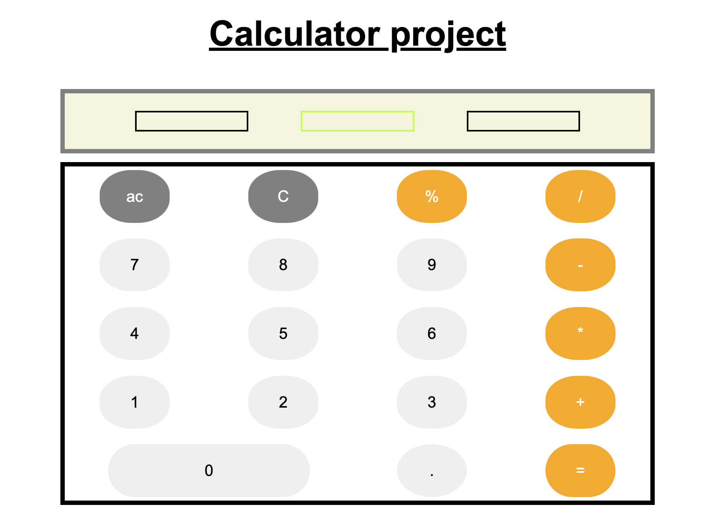

# calculator web app

A simple web-based calculator application 

## Features 

- basic operations (+,-,*,/)
- clear button
- percentage calculation 
- responsive design 

# usage 
- use the buttons to perfrom caculation 
- press "=" to see the results

[This is the link to the project](https://github.com/omar12ahmed/calculator)

[This is a link to my repo](https://omar12ahmed.github.io/calculator/)